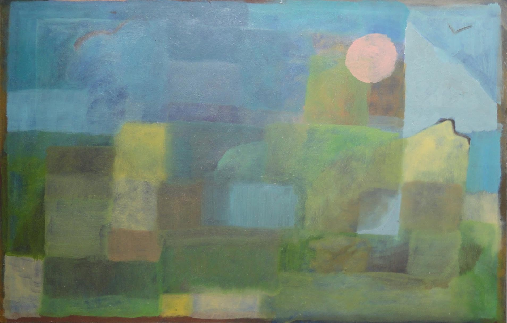
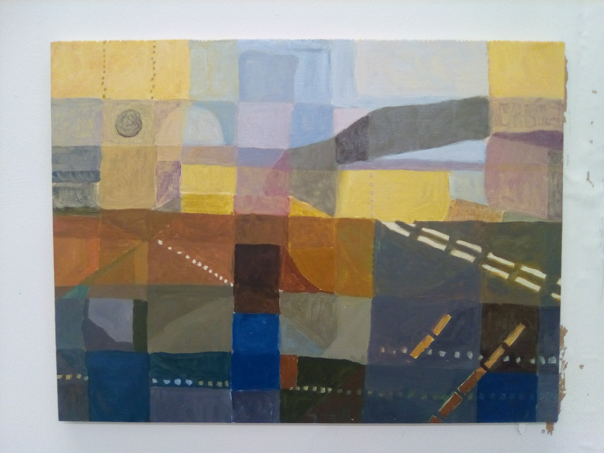

# Artistic Development

Expression, experimentation, experiencing the world in a new way, are all crucial in my programming practise and stem from early childhood involvement in Fine Art.

At the time of writing I enjoy the medium of dance. Artistically and professionally, I am more and more involved in the joy of collaboration... In contrast the Paintings pictured below took place in what appears to have been more of a soul-searching period of my life. 

<!--TODO: Add images, captions -->

# Abstract explorations, 2016

# Figuration at Royal Drawing School, 2017

# Return to Abstraction, 2018

