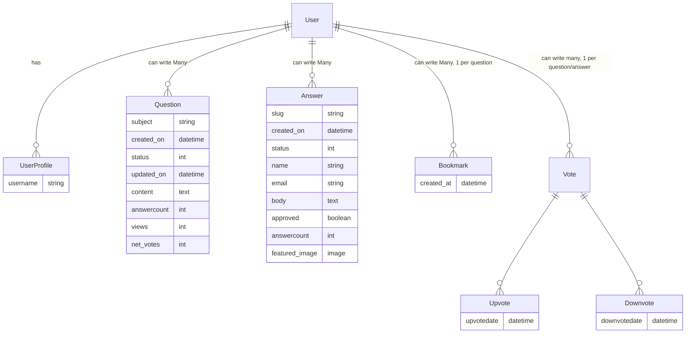
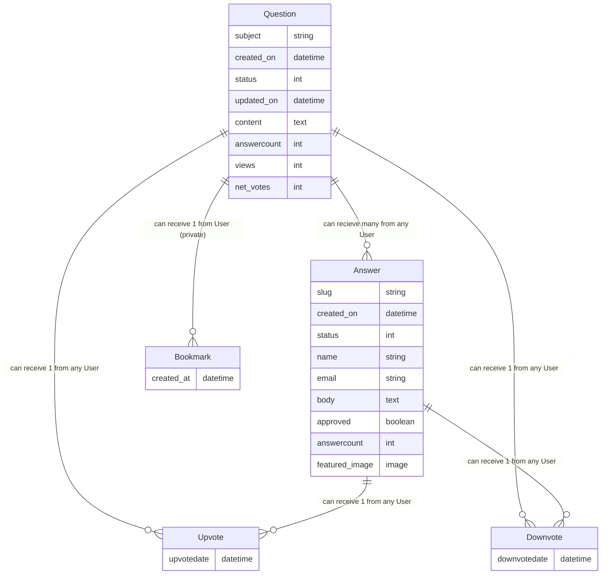

# Coach Matrix 

Coach Matrix is an open-source CPD platform for educators to connect and share knowledge.


# 1. Features

The following features were implemented, tested and debugged throughout the development process. Many of them are tightly interwoven e.g. Users Post Questions with Tags.

## 1.1. User Posts Questions which can be answered and voted 
Users can post questions, which can be edited and deleted. 

## 1.2. Questions have tags which can be found through the filter view 

Tags are used throughout the programme. Users can add tags to their questions. Users can also filter for questions by tag.

##  1.3. User Posts Answers to Questions

Users can post answers in response to questions, which can be edited and deleted.

##  1.4. User votes for both questions and answers  

Users can upvote and downvote both questions and answers

##  1.5. Toggle Sort content by highest vote vs newest post  

The user can toggle between sorting content by highest vote vs newest post. The default is highest vote. This applies to both questions and answers. Answers also provides a toggle to sort by oldest post, so they can get a sense of the narrative.

##  1.6. Landing Page with login and sign up tabs 

The landing page provides a brief description of the site and a call to action to sign up. It also provides a link to the questions page. It features appealing animations and a video background. 

Dynamic Tabs are used to toggle between sign in and sign up.

For Accessibility an option to pause the video is provided.

For surface appeal dynamic animations are included, including a custom CSS logo.

## 1.7. User creates, reads and deletes bookmarks. 

The user can bookmark questions. This is particularly useful for questions that the user wants to return to later.

## 1.8. User updates Authentication details 

The user can update their profile. This includes updating their username and password.

##  1.9. Navbar 

The navbar provides all the important links to the landing page, questions page, and the user's profile. It also provides a link to sign in and sign out.

A custom CSS Logo is included in the navbar.


##  1.10. Footer 

The footer provides links to the developer's social media and a link to the developer's portfolio.

## 1.11. About Page 

The About Page provides a brief description of the site and introduces the developer. It also links to this README and the developer's portfolio.

## 1.12. Error Messages 


Custom error messages are used to provide feedback to the user.


# 2. User Stories reviewed against UX Planes and Manual Testing

## 2.1. Strategy plane

The key strategy in this project was to use a Manual Testing Spreadsheet that would establish 
- the user stories
- the acceptance criteria that would be used to establish the feature as implemented
- the validation criteria that would be used to establish the feature as working under "high-stress" conditions e.g. a user trying to break the site.
- the design criteria that would be used to establish the feature as visually appealing and engaging to the target audience. This was generic for all features.
- Track Progress using ✅ for TRUE and ❌ for FALSE in the validation criteria.

Full testing can be reviewed here:
https://docs.google.com/spreadsheets/d/1tii97g0Q4bVVvkrn_llrX8nOc_N2EyoOecOuMOEYFz0/edit?usp=sharing

***

<details>
<summary>Manual Testing PASSED Spreadsheet</summary>


</details>

<br>

<details>
<summary>Not Yet Implemented Spreadsheet</summary>

</details>

***

Discarded strategies included using a Todoist Kanban board and a large 900x1200mm whiteboard with a 3x3 grid. The spreadsheet was chosen as it was both the most efficient way to track progress while also able to carry the most accurate information for the developer.

## 2.2. Scope plane

Based on the user stories above, the following features were prioritised which you can see in the [features section](1-features) above.

## 2.3. Structure plane

The structure plane was particularly important with this project and are best summarised through the framework of Django:

Structure contents:
- [App Structure](#231-app-structure)
- [Models](#232-models)
- [Forms](#233-forms)
- [Views](#234-views)
- [Templates](#235-templates)
- [URLPatterns](#236-urlpatterns)
- [Static Files](#237-static-files)
- [JavaScript Front-End Logic](#238-javascript-front-end-logic)

### 2.3.1. App Structure

The app structure was particularly important with this project. The following app structure was concieved.

coach_matrix was the general project folder with important files being:
- settings.py holding the django settings for the project, such as installed apps and middleware
- urls.py holding the urls for the project and linking to the main_forum app

coach_matrix was the general project folder with important files being settings.py holding the django settings for the project, such as installed apps and middleware and urls.py holding the urls for the project and linking to the main_forum app.

main_forum was the django app with important files being:
- models.py holding the database schema
- forms.py holding the forms such as asking questions and answering questions
- views.py holding the views for the questions and answers. This was divided into many separate subdirectories and put together in an init.py file.
- urls.py holding the urls together within the app

main_forum was the django app with important files being models.py holding the database schema, forms.py holding the forms such as asking questions and answering questions, views.py holding the views for the questions and answers. This was divided into many separate subdirectories and put together in an init.py file, urls.py holding the urls together within the app.

users was the django app for user authentication with important files being forms.p views.py and urls.py. It included a user model for updating the profile and sign in functionality.

### 2.3.2. Models

The following diagrams were used to plan the models in `main_forum` and were tested and debugged throughout the development process.

The Diagrams were divided between User and Question point of view for better readability

**Mermaid Diagram 1: User Point of View**
Below illustrates the simplified view of the user model. The user can have a profile, ask questions, write answers, bookmark questions and vote on questions and answers.


***

**Mermaid Diagram 2: Question Point of View**
Below illustrates the relationship between questions and answers. A question can have many answers, and both a quesiton and an answer can have many votes.



***

**Methods used:**

| model method | description | example | documentation-link for Django 4.1 |
| --- | --- | --- | --- |
| class-based models | models that are classes, these are particularly useful for models that require a lot of methods  | Question | https://docs.djangoproject.com/en/4.1/topics/db/models/ |
| meta class | a class within a class that provides metadata for the model | Meta class for the question model | https://docs.djangoproject.com/en/4.1/ref/models/options/ |
| __str__ | a method that returns a string representation of the object | __str__ for the question model | https://docs.djangoproject.com/en/4.1/ref/models/instances/#django.db.models.Model.__str__ |
| ForeignKey | a field that links to another model | ForeignKey for the question model | https://docs.djangoproject.com/en/4.1/ref/models/fields/#foreignkey |
| ManyToManyField | a field that links to another model with a many-to-many relationship | ManyToManyField for the question model | https://docs.djangoproject.com/en/4.1/ref/models/fields/#manytomanyfield |
| CharField | a field for storing a string | CharField for the question model | https://docs.djangoproject.com/en/4.1/ref/models/fields/#charfield |
| TextField | a field for storing a large amount of text | TextField for the question model | https://docs.djangoproject.com/en/4.1/ref/models/fields/#textfield |
| DateTimeField | a field for storing a date and time | DateTimeField for the question model | https://docs.djangoproject.com/en/4.1/ref/models/fields/#datetimefield |
| IntegerField | a field for storing an integer | IntegerField for the question model | https://docs.djangoproject.com/en/4.1/ref/models/fields/#integerfield |
| SlugField | a field for storing a slug | SlugField for the question model | https://docs.djangoproject.com/en/4.1/ref/models/fields/#slugfield |
| save method | a method that saves the object | save method for the question model | https://docs.djangoproject.com/en/4.1/ref/models/instances/#django.db.models.Model.save |
| super method | a method that calls the parent class method | super method for the question model | https://docs.djangoproject.com/en/4.1/ref/models/instances/#django.db.models.Model.save |
| count method | a method that counts the number of objects | count method for the question model | https://docs.djangoproject.com/en/4.1/ref/models/querysets/#count |
| related_name | a field that provides a name for the reverse relation | related_name for the question model | https://docs.djangoproject.com/en/4.1/ref/models/fields/#django.db.models.ForeignKey.related_name |
| @reciever | a decorator that connects a signal to a function | @reciever for the question model | https://docs.djangoproject.com/en/4.1/ref/signals/#django.dispatch.receiver |
| ordering | a field that orders the queryset | ordering for the question model | https://docs.djangoproject.com/en/4.1/ref/models/options/#ordering |
| instance | a method that returns the instance of the object | instance for the question model | https://docs.djangoproject.com/en/4.1/ref/models/instances/#django.db.models.Model.instance |


### 2.3.3. Forms

The following forms were used.

| form method | description | example | documentation-link for Django 4.1 |
| --- | --- | --- | --- |
| class-based forms | forms that are classes, these are particularly useful for forms that require a lot of methods  | QuestionForm | https://docs.djangoproject.com/en/4.1/topics/forms/ |
| save method | a method that saves the object | save method for the question form | https://docs.djangoproject.com/en/4.1/ref/models/instances/#django.db.models.Model.save |
| clean method | a method that cleans the form | clean method for the question form | https://docs.djangoproject.com/en/4.1/ref/forms/validation/#cleaning-and-validating-fields-that-depend-on-each-other |
| __init__ method | a method that initialises the form | __init__ method for the question form, This is for checking if the form is bound to an existing instance, i.e. if the form is being used to update an existing question | https://docs.djangoproject.com/en/4.1/ref/forms/api/#django.forms.Form.__init__ |

### 2.3.4. Views

Numerous views were used in main_forum and users and were split into seperate folders. There were many important methods used in the views.

| function method | description | example | documentation-link for Django 4.1 |
| --- | --- | --- | --- |
| class-based views | views that are classes, these are particularly useful for views that require a lot of methods  | QuestionDetail View | https://docs.djangoproject.com/en/4.1/topics/class-based-views/ |
| get_context_data | gets the context data for the view | get_context_data for the question detail view | https://docs.djangoproject.com/en/4.1/ref/class-based-views/mixins-single-object/#django.views.generic.detail.SingleObjectMixin.get_context_data |
| get_queryset | gets the queryset for the view | get_queryset for the question detail view | https://docs.djangoproject.com/en/4.1/ref/class-based-views/mixins-single-object/#django.views.generic.detail.SingleObjectMixin.get_queryset |
| get_object_or_404 | gets the object or returns a 404 error | get_object_or_404 for the question detail view | https://docs.djangoproject.com/en/4.1/topics/http/shortcuts/#get-object-or-404 |
| get | retrieves a page | get request for questions page | https://docs.djangoproject.com/en/4.1/ref/request-response/#django.http.HttpRequest.GET |
| post | sends data to the server | post request for asking a question | https://docs.djangoproject.com/en/4.1/ref/request-response/#django.http.HttpRequest.POST |
| form_valid | checks if the form is valid | form_valid for asking a question | https://docs.djangoproject.com/en/4.1/ref/class-based-views/mixins-editing/#django.views.generic.edit.FormMixin.form_valid |
| form_invalid | checks if the form is invalid | form_invalid for asking a question | https://docs.djangoproject.com/en/4.1/ref/class-based-views/mixins-editing/#django.views.generic.edit.FormMixin.form_invalid |
| get_success_url | gets the success url | get_success_url for asking a question | https://docs.djangoproject.com/en/4.1/ref/class-based-views/mixins-editing/#django.views.generic.edit.FormMixin.get_success_url |
| test_func | checks if the user is allowed to access the view | test_func for the question detail view | https://docs.djangoproject.com/en/4.1/ref/class-based-views/mixins-permission/#django.views.generic.detail.SingleObjectMixin.test_func |

| return method | description | example | documentation-link for Django 4.1 |
| --- | --- | --- | --- |
| return | returns a page | return for asking a question | https://docs.djangoproject.com/en/4.1/ref/request-response/#django.http.HttpResponse |
| return render() | renders a page | render for the questions page | https://docs.djangoproject.com/en/4.1/topics/http/shortcuts/#render |
| return redirect | redirects to a page | redirect for asking a question | https://docs.djangoproject.com/en/4.1/topics/http/shortcuts/#redirect |
| return Model.objects.filter() | filters the queryset | .objects.filter() for the questions page | https://docs.djangoproject.com/en/4.1/topics/db/queries/#retrieving-specific-objects-with-filters |
| return self.request.user | returns the user | self.request.user for the question detail view | https://docs.djangoproject.com/en/4.1/ref/request-response/#django.http.HttpRequest.user |
| return self.get_object() | returns the object | self.get_object() for the question detail view | https://docs.djangoproject.com/en/4.1/ref/class-based-views/mixins-single-object/#django.views.generic.detail.SingleObjectMixin.get_object |

| general method | description | example | documentation-link for Django 4.1 |
| --- | --- | --- | --- |
| class-based views | views that are classes, these are particularly useful for views that require a lot of methods  | QuestionDetail View | https://docs.djangoproject.com/en/4.1/topics/class-based-views/ |


<!-- | put | updates data | put request for updating a question | https://docs.djangoproject.com/en/4.1/ref/request-response/#django.http.HttpRequest.PUT | -->
<!-- | delete | deletes data | delete request for deleting a question | https://docs.djangoproject.com/en/4.1/ref/request-response/#django.http.HttpRequest.DELETE | -->

### 2.3.5. Templates

The following templates were used the hyperlinks were summarised in this diagram.

templates was the folder for seperate html templates, some of which were imported from django-allauth
- base.html was the master template with the head links, navbar and footer. It also linked to the master css file and the js files. It appears on every page.
- other file names are more self-explanatory such as questions.html and question_detail.html

| template method | description | example | documentation-link for Django 4.1 |
| --- | --- | --- | --- |
| extends | extends a template | extends for the questions page | https://docs.djangoproject.com/en/4.1/ref/templates/builtins/#extends |
| block | defines a block | block for the questions page | https://docs.djangoproject.com/en/4.1/ref/templates/builtins/#block |
| include | includes a template | include for the questions page | https://docs.djangoproject.com/en/4.1/ref/templates/builtins/#include |
| url | links to a url | url for the questions page | https://docs.djangoproject.com/en/4.1/ref/templates/builtins/#url |
| static | links to a static file | static for the questions page | https://docs.djangoproject.com/en/4.1/ref/templates/builtins/#static |
| csrf_token | adds a csrf token | csrf_token for the questions page | https://docs.djangoproject.com/en/4.1/ref/templates/builtins/#csrf-token |
| form.as_p | renders a form | form.as_p for the questions page | https://docs.djangoproject.com/en/4.1/ref/forms/api/#django.forms.Form.as_p |
| crispy | renders a form with crispy forms | crispy for the questions page | https://django-crispy-forms.readthedocs.io/en/latest/ |
| load socialaccount | loads the social account template | load socialaccount for the questions page | https://rdmo.readthedocs.io/en/latest/configuration/authentication/allauth.html#social-accounts |
| extra_head | adds extra head content | extra_head for the questions page | https://www.ericholscher.com/blog/2008/nov/20/gentlemans-agreement-django-templates/#block-extra-head |


### 2.3.6. URLPatterns

The following URLPatterns were used.

$$$$ INSERT CODE $$$$$

| urlpattern method | description | example | documentation-link for Django 4.1 |
| --- | --- | --- | --- |
| path | links to a view | path for the questions page | https://docs.djangoproject.com/en/4.1/ref/urls/#path |
| name | names a url | name for the questions page | https://docs.djangoproject.com/en/4.1/ref/urls/#name |
| as_view | calls a view | as_view for the questions page | https://docs.djangoproject.com/en/4.1/ref/class-based-views/base/#django.views.generic.base.View.as_view |
| int:pk | passes an integer primary key | int:pk for the question detail view | https://docs.djangoproject.com/en/4.1/topics/http/urls/#path-converters |
| slug:slug | passes a slug | slug:slug for the question detail view | https://docs.djangoproject.com/en/4.1/topics/http/urls/#path-converters |

### 2.3.7. Static Files

static was the folder for static files such as css and javascript. This was later hosted on `cloudinary` for deployment using ```dj3-cloudinary-storage```.
- CSS had a master css file then a separate css file for each html template
- JS had a separate js files for each html template
- data was a folder for json files
- media was a folder for fonts and images. In some instances media files were delegated to cloudinary URL directly, such as a video background on the login page.

### 2.3.8. JavaScript Front-End Logic

JavaScript was used to add front-end logic to the site. This was particularly important for the toggle views between compact and expanded. The following methods were used.

static/js/ask_question.js
static/js/bg-logo.js
static/js/login.js
static/js/navbar.js

## 2.4.  Skeleton plane

### 2.4.1. Skeleton Plane Acceptance Criteria

THe following criteria was used to test the skeleton plane. You can refer back to the [speadsheet](#21-strategy-plane) in the strategy plane to see the progress of the acceptance criteria against the features.

- The feature can be viewed from 300px to 1920px, without unintended results such as:
    - unintented text overflowing
    - unintended overlapping
    - unintended hidden content
    - unintended large gaps
    - unintended text sizing

Where appropriate, the feature is responsive to the screen size, and could split into columns or rows as the screen size decreases. A single column does not fail the acceptance criteria as the site is designed mobile-first,therefore should be responsive to mobile devices.

### 2.4.2. Early Wireframes using Figma

Figma was used to create the early wireframes during the design process, prioritising a mobile-first approach. The wireframes can be found here:

https://www.figma.com/file/jXT4Bi1WXVwYG4daO3Yczi/Portfolio-Project-4?type=design&node-id=0%3A1&mode=design&t=0DTJelaO4PzBf99a-1

$$$$$$$$$$$$ SCREENSHOT HERE $$$$$$$$$$$$$$$

The category feature was omitted from the final design as it was deemed to be too complex. Other omissions included the use of a logo backgrouund and reputation points. These plan to be added in future versions.

### 2.4.3. Feature drafting with CodePen

Codepen was used to draft code snippets in the front-end using bootstrap and css. This platform was chosen for it's efficient interface. 

The codepen collection can be found here:
https://codepen.io/collection/jbEjoo

| Collection | Description | Link |
|----|---| ---|
| Master | master CSS files, e.g. colour schemes | https://codepen.io/collection/yrwrJZ |
| Components | components HTML CSS and JS files | https://codepen.io/collection/jbEjoo |

|Codepen| Description | Link |
|---|---| ---|
| Login Page | login page HTML CSS and JS  | https://codepen.io/lauriecrean/pen/wvZqZyZ |
| Ask Question Page | questions page HTML CSS and JS | https://codepen.io/lauriecrean/pen/rNRYZYK |

### 2.4.4. CSS Skeleton Testing

The following files were used to test responsivity:

```
static/css/components/about.css
static/css/components/answercard.css
static/css/components/ask_question.css
static/css/components/errors.css
static/css/components/login.css
static/css/components/navbar.css
static/css/components/question_detail.css
static/css/components/votingcard.css
```

### 2.4.5. HTML Bootstrap Testing

Bootstrap was also used throughout the project as an efficient way to use CSS resources.

| bootstrap method | syntax | example | documentation-link for Bootstrap 5.3 |
| --- | --- | --- | --- |
| container | `<div class="container">` | container for the questions page | https://getbootstrap.com/docs/5.3/layout/containers/ |
| row | `<div class="row">` | row for the questions page | https://getbootstrap.com/docs/5.3/layout/grid/ |
| col | `<div class="col">` |  col for the questions page | https://getbootstrap.com/docs/5.3/layout/grid/ |
| card | `<div class="card">` |  card for the questions page | https://getbootstrap.com/docs/5.3/components/card/ |
| modal | `<div class="modal">` |  modal for the questions page | https://getbootstrap.com/docs/5.3/components/modal/ |
| d-flex | `<div class="d-flex">` |  d-flex for the questions page | https://getbootstrap.com/docs/5.3/utilities/flex/ |


## 2.5. Surface plane

The colour scheme was chosen to be bright and engaging, with a primary colour of dark turqoise.

Root vars were used to make the colour scheme consistent throughout the site with a more.

### 2.5.1. Surface Plane acceptance criteria

The following criteria was used to test the surface plane. You can refer back to the [speadsheet](#21-strategy-plane) in the strategy plane to see the progress of the acceptance criteria against the features.

- The feature is designed with an acceptable colour scheme
 - consistent colour scheme with primary, secondary and monochrome colours all defined in the root vars
 - consistent typefaces of Yeseva One and Glacial Indifference
 - consistent design of buttons

### 2.5.2. CSS Surface Testing

```css
:root {
    /* Primary Color Variations */
    --primary-color-lightest: #4dd0e1;
    /* Lightest shade, closer to 'primary-color-dark' */
    --primary-color-light: #26c6da;
    /* Light shade, closer to 'primary-color-dark' */
    --primary-color-medium: #00acc1;
    /* Medium shade, closer to 'primary-color-dark' */
    --primary-color-dark: #009693;
    /* Unchanged, original dark shade */
    --primary-color-darkest: #00897b;
    /* Darkest shade, closer to 'primary-color-dark' */

    /* Secondary Color Variations */
    --secondary-color-lightest: #ffccbc;
    /* Lightest shade, closer to 'secondary-color-dark' */
    --secondary-color-light: #ffab91;
    /* Light shade, closer to 'secondary-color-dark' */
    --secondary-color-medium: #ff8a65;
    /* Medium shade, closer to 'secondary-color-dark' */
    --secondary-color-dark: #f46b17;
    /* Unchanged, original dark shade */
    --secondary-color-darkest: #e64a19;
    /* Darkest shade, closer to 'secondary-color-dark' */

    /* Monochrome Color Variations */
    --mono-lightest: #cfd8dc;
    /* Lightest shade, closer to 'mono-dark' */
    --mono-light: #b0bec5;
    /* Light shade, closer to 'mono-dark' */
    --mono-medium: #90a4ae;
    /* Medium shade, closer to 'mono-dark' */
    --mono-dark: #737373;
    /* Unchanged, original dark shade */
    --mono-darkest: #546e7a;
    /* Darkest shade, closer to 'mono-dark' */
}
```

Animations were also used to make the site more engaging, for example in the landing page.

The logo was also designed by the developer as CSS, as a way to incorperate more dynamic animation on the landing.

### 2.5.3. FontAwesome 

FontAwesome was used to add icons throughout the site including.

- The Navbar.
- Edit and Delete buttons.
- Bookmark
- Flag

### 2.5.4. Media Surface Testing

The media contributed to the surface plane with various vectors and videos.

- the video is a montage of various educational settings, formed from pexels.com and collaged manually using [CapCut](http://capcut.com) and was used for a video background on the landing page.
- the icons were used from [Canva](http://canva.com)'s vector library permitting educational use. They were used for the voting buttons and the navbar.

</details>

# 3. Automatic Testing and Deployment

## 3.1. Browserstack testing

Browserstack was used to test the site on different devices and browsers. 

The following devices were tested:

- iPhone 13
- Samsung Galaxy S21
- iPad Pro
- MacBook Pro
- Windows 10

The following browsers were tested:
- Chrome
- Firefox
- Safari
- Edge

## 3.2. Lighthouse testing

Lighthouse was used to test the site for performance, accessibility, best practices and SEO. The following scores were achieved:

| page | lightouse score | mobile/desktop | date |
| --- | --- | --- |
| landing |  | mobile |  |
| landing |  | desktop |  |
| questions |  | mobile |  |
| questions |  | desktop |  |
| question detail |  | mobile |  |
| question detail |  | desktop |  |


## 3.3. Deployment to Heroku

The site was deployed on Heroku. The following steps were taken to deploy the site:

1. Create a requirements.txt file using the following command in the terminal:

    ```bash
    pip3 freeze --local > requirements.txt
    ```

2. Create a Procfile using the following command in the terminal:

    ```bash
    echo web: gunicorn coach_matrix.wsgi:application > Procfile
    ```

3. Push the requirements.txt and Procfile to GitHub.
4. Create a new app on Heroku.
5. Link the app to the GitHub repository.
6. Set the following config vars in the Heroku settings:

    ```bash
    CLOUDINARY_API_KEY

   CLOUDINARY_API_SECRET

   CLOUDINARY_CLOUD_NAME

   CLOUDINARY_URL

   DATABASE_URL

   PORT

   SECRET_KEY
    ```

7. Deploy the app on Heroku.

## 3.4. Deployment from Heroku to coachmatrix.org

The site was deployed on http://coachmatrix.org. The following steps were taken to deploy the site:

1. aquire the domain from [namecheap](http://namecheap.com)
2. link the domain to the heroku app using the following DNS settings:

    ```bash
    CNAME www -> [DNS Target from Heroku e.g. dnsaddress.herokuapp.com]
    ALIAS @ -> [DNS Target from Heroku e.g. dnsaddress.herokuapp.com]
    ```

## 3.5. Python Validation with PEP8 guidelines

All major python models, views and templates were validated through PEP8 style guide on 21st March 2024.

https://pep8ci.herokuapp.com/

The PEP8 style guide ensures that the code is readable and maintainable. Rules include:

- Line length should be less than 79 characters
- Indentation should be 4 spaces
- Blank lines should be used to separate functions and classes
- New lines should be used to separate blocks of code
- Two spaces should be used before an inline comment
- No trailing whitespaces at end of code lines

## 3.6. HTML Validation with W3C guidelines

The landing page was validated through W3C HTML validator on 21st March 2024.

https://validator.w3.org/

Other templates are in process of being validated.

## 3.7. 
All CSS files were validated through W3C CSS validator on 21st March 2024 and passed with no errors.

```
static/css/components/about.css
static/css/components/answercard.css
static/css/components/ask_question.css
static/css/components/errors.css
static/css/components/login.css
static/css/components/navbar.css
static/css/components/question_detail.css
static/css/components/votingcard.css
static/css/animations.css
static/css/colors.css
static/css/interactions.css
static/css/master.css
static/css/styling.css
static/css/typefaces.css
```

# 4. Issues and Bugs

All major issues and bugs were documented on StackOverflow, which turned out to be an invaluable learning strategy for debugging.

In the timeframe of this project it was not practical to migrate the full stackoverflow posts to this README, which would require extra heading formatting. Instead, I have copy and pasted the issue and solution for the first issue, then the following are provided a link to my stackoverflow. 

<b>NOTE TO CODE INSTITUTE ASSESSORS: all stackoverflowposts were written in my own words, all stackoverflow posts included a solution documented by myself in my own words</b>.

## 4.1. "Cannot Access Django-Admin Panel on Port." 

“Cannot Access Django-Admin Panel on Port.” Stack Overflow, https://stackoverflow.com/questions/77465837/cannot-access-django-admin-panel-on-port. Accessed 12 Nov. 2023.

<details><summary><i>issue</i></summary>

### Expecting to be able to access django admin panel and add social accouunt 

opening admin panel by adding standard `admin/` extension to local preview port URL. This is expected to lead to classic [django admin panel.](https://www.programink.com/static/img/django-admin-login.png)

**going to the admin url instead leads to an [error message](https://i.stack.imgur.com/z4v0U.png)**

the website is otherwise displaying fine.

*A simple google oath signin is currently being implemented.*

### Error message: 

```
DoesNotExist at /admin/login/
Site matching query does not exist.
Request Method:	GET
Request URL:	http://8000-lmcrean-project4-avaw7dd1zq8.ws-eu106.gitpod.io/admin/login/?next=/admin/
Django Version:	3.2.23
Exception Type:	DoesNotExist
Exception Value:	
Site matching query does not exist.
Exception Location:	/workspace/.pip-modules/lib/python3.9/site-packages/django/db/models/query.py, line 435, in get
Python Executable:	/home/gitpod/.pyenv/versions/3.9.17/bin/python3
Python Version:	3.9.17
Python Path:	
['/workspace/Project-4',
 '/home/gitpod/.pyenv/versions/3.9.17/lib/python39.zip',
 '/home/gitpod/.pyenv/versions/3.9.17/lib/python3.9',
 '/home/gitpod/.pyenv/versions/3.9.17/lib/python3.9/lib-dynload',
 '/workspace/.pip-modules/lib/python3.9/site-packages',
 '/home/gitpod/.pyenv/versions/3.9.17/lib/python3.9/site-packages']
Server time:	Sat, 11 Nov 2023 15:17:58 +0000
```

[traceback details in full](https://file.io/haymHM3ANkEI)

### Currently trying to fix with this tutorial 

“Set up Google Sign-in for Faster Django Login Experience Feat. Tech with Tim.” Akamai DevRel, YouTube Video, 12 Dec. 2022, https://youtu.be/yO6PP0vEOMc?feature=shared&t=1328. Accessed 11 Nov. 2023.

- have followed correctly with all working up to 22 minutes in
- migration was recently made after setting up urls, views and templates for google oauth as per the tutorial, there were no obvious issues with this
- before that django-admin panel seemed to be working fine


## settings.py and url are likely problem areas 


installed apps seems ok on [settings.py - can be viewed here in full](https://file.io/HDZjRjk17k3w)

this was recently implemented but is correct according to tutorial:
```
AUTHENTICATION_BACKENDS = (
    "django.contrib.auth.backends.ModelBackend",
    "allauth.account.auth_backends.AuthenticationBackend"
)
```


urlpatterns in urls.py
```
urlpatterns = [
    path('admin/', admin.site.urls),
    path("", include("blog.urls"), name="blog-urls"),
    path('summernote/', include('django_summernote.urls')),
    path("accounts/", include("allauth.urls")),
    path("", include("users.urls"))
]
```

</details>

<details><summary><i>solution</i></summary>

The error message "Site matching query does not exist," typically occurs in Django when the SITE_ID setting in settings.py refers to a Site object that does not exist in the database.

I managed to debug this with the Python Shell by checking existing site ID.

    from django.contrib.sites.models import Site
    existing_site = Site.objects.get(domain='http://127.0.0.1:8000')
    print(existing_site.id)

The returning statement revealed that the SITE_ID should be 2, not 1 as previously set.

This was fixed with an update to settings.py to match the correct site ID:

    SITE_ID = 2

[The django admin panel can now be accessed][1] without any further errors.


[1]: https://i.stack.imgur.com/GY9LK.png

</details>

## 4.2. "IntegrityError When Adding Social Application in Django: Null Value in Column ‘Provider_id.’" 
“IntegrityError When Adding Social Application in Django: Null Value in Column ‘Provider_id.’” Stack Overflow, https://stackoverflow.com/questions/77466342/integrityerror-when-adding-social-application-in-django-null-value-in-column-p. Accessed 12 Nov. 2023.

## 4.3. "Cannot Delete ‘Forgot Password?’ On Sign in Page. Seems Completely Unresponsive to Code." 
“Cannot Delete ‘Forgot Password?’ On Sign in Page. Seems Completely Unresponsive to Code.” Stack Overflow, https://stackoverflow.com/questions/77427112/cannot-delete-forgot-password-on-sign-in-page-seems-completely-unresponsive. Accessed 12 Nov. 2023.

## 4.4. "Cannot Access Django-Admin Panel on Port."
“Cannot Access Django-Admin Panel on Port.” Stack Overflow, https://stackoverflow.com/questions/77465837/cannot-access-django-admin-panel-on-port. Accessed 26 Nov. 2023.


## 4.5. "Django NoReverseMatch Error for ‘questions’ View After Google OAuth Sign-In."
“Django NoReverseMatch Error for ‘questions’ View After Google OAuth Sign-In.” Stack Overflow, https://stackoverflow.com/questions/77547799/django-noreversematch-error-for-questions-view-after-google-oauth-sign-in. Accessed 26 Nov. 2023.

## 4.6. "Social Login Expects to Lead to Questions.Html via Django Urlpatterns, Instead Leads to Home Page."
“Social Login Expects to Lead to Questions.Html via Django Urlpatterns, Instead Leads to Home Page.” Stack Overflow, https://stackoverflow.com/questions/77634816/social-login-expects-to-lead-to-questions-html-via-django-urlpatterns-instead-l. Accessed 10 Dec. 2023.


## 4.7. "Django QuestionForm in Forms.Py Not Creating Instance in Questions.Html."
“Django QuestionForm in Forms.Py Not Creating Instance in Questions.Html.” Stack Overflow, https://stackoverflow.com/questions/77704846/django-questionform-in-forms-py-not-creating-instance-in-questions-html. Accessed 25 Dec. 2023.

## 4.8. "Django taggit view leading to FieldError: Related Field got invalid lookup: name"
Django taggit view leading to FieldError: Related Field got invalid lookup: name. (n.d.). Stack Overflow. Retrieved February 20, 2024, from https://stackoverflow.com/questions/78012162/django-taggit-view-leading-to-fielderror-related-field-got-invalid-lookup-name

## 4.9. "profile_update_form does not update field correctly, print logs suggest issue with redundant if statement
profile_update_form does not update field correctly, print logs suggest issue with redundant if statement. (n.d.). Stack Overflow. Retrieved February 20, 2024, from https://stackoverflow.com/questions/78016607/profile-update-form-does-not-update-field-correctly-print-logs-suggest-issue-wi

##  4.10. "Tag instances via django-taggit are not rendering as expected in update post form."

Tag instances via django-taggit are not rendering as expected in update post form. (n.d.). Stack Overflow. Retrieved March 28, 2024, from https://stackoverflow.com/questions/78096352/tag-instances-via-django-taggit-are-not-rendering-as-expected-in-update-post-for

 # 5. Acknowledgement and credits

This section is dedicated to all acknowledgements and credits of external resources used in the development of the site.

 ## 5.1. Coding Languages

The following languages were used in the development of the site:

- [HTML](https://en.wikipedia.org/wiki/HTML)
    - HTML is the standard markup language for documents designed to be displayed in a web browser.
- [CSS](https://en.wikipedia.org/wiki/CSS)
    - Cascading Style Sheets is a style sheet language used for describing the presentation of a document written in a markup language such as HTML.
- [JavaScript](https://en.wikipedia.org/wiki/JavaScript)
    - JavaScript, often abbreviated as JS.
- [Python](https://www.python.org/)
    - Python is an interpreted high-level general-purpose programming language.

 ## 5.2. Frameworks, Libraries and Programs

The following frameworks, libraries and programs were used in the development of the site:

### 5.2.1. Front-end modules

The following front-end libraries were used in the development of the site:

- [Bootstrap](https://getbootstrap.com/)
    - Bootstrap was used to assist with the responsiveness and styling of the website.
- [Font Awesome](https://fontawesome.com/)
    - Font Awesome was used on all pages throughout the website to add icons for aesthetic and UX purposes.
- [JQuery](https://jquery.com/)
    - jQuery came with Bootstrap to make the navbar responsive.

### 5.2.2. Back-end modules

The following Python libraries were used in the development of the site:

- [asgiref](https://pypi.org/project/asgiref/)
    - ASGI is a standard for Python asynchronous web apps and servers to communicate with each other, and positioned as an asynchronous successor to WSGI.
- [better-profanity](https://pypi.org/project/better-profanity/)
    - A Python library to check for profanity in a given text. This was used to check for profanity in questions and answers.
- [cloudinary](https://cloudinary.com/)
    - Cloudinary is a cloud service that offers a solution to a web application's entire image management pipeline.
- [dj-database-url](https://pypi.org/project/dj-database-url/)
    - This simple Django utility allows you to utilize the 12factor inspired DATABASE_URL environment variable to configure your Django application.
- [dj3-cloudinary-storage](https://pypi.org/project/dj3-cloudinary-storage/)
    - A Django storage backend for Cloudinary.
- [Django](https://www.djangoproject.com/)
    - Django is a high-level Python Web framework that encourages rapid development and clean, pragmatic design.
- [django-allauth](https://django-allauth.readthedocs.io/en/latest/)
    - Integrated set of Django applications addressing authentication, registration, account management as well as 3rd party (social) account authentication.
- [django-crispy-forms](https://django-crispy-forms.readthedocs.io/en/latest/)
    - django-crispy-forms provides you with a |crispy filter and  tag that will let you control the rendering behavior of your Django forms in a very elegant and DRY way.
- [django-quill-editor](https://pypi.org/project/django-quill-editor/)
    - A Django app to use Quill editor in forms. This was used on the ask question page and the answer question page (question_detail.html).
- [django-taggit](https://pypi.org/project/django-taggit/)
    - Simple tagging for Django. This was used to implement tags for questions using `TaggableManager.` The tags can also be created through the admin panel.
- [gunicorn](https://gunicorn.org/)
    - Gunicorn 'Green Unicorn' is a Python WSGI HTTP Server for UNIX.
- [oauthlib](https://oauthlib.readthedocs.io/en/latest/)
- [psycopg2](https://pypi.org/project/psycopg2/)
    - Psycopg is the most popular PostgreSQL database adapter for the Python programming language.
- [PyJWT](https://pyjwt.readthedocs.io/en/stable/)
    - A Python library which allows you to encode and decode JSON Web Tokens (JWT).
- [python3-openid](https://pypi.org/project/python3-openid/)
    - This is a set of Python packages to support use of the OpenID decentralized identity system in your application.
- [pytz](https://pypi.org/project/pytz/)
    - pytz brings the Olson tz database into Python.
- [requests-oauthlib](https://pypi.org/project/requests-oauthlib/)
    - OAuthlib support for Python-Requests!
- [sqlparse](https://pypi.org/project/sqlparse/)
    - A non-validating SQL parser module for Python.
- [taggit](https://pypi.org/project/django-taggit/)
    - Simple tagging for Django. This was used to implement tags for questions.
    - TaggableManager was used to manage tags
- [urllib3](https://pypi.org/project/urllib3/)
    - urllib3 is a powerful, sanity-friendly HTTP client for Python.
- [whitenoise](http://whitenoise.evans.io/en/stable/)
    - Radically simplified static file serving for Python web apps. This was used to serve static files in production.

<details><summary>
click here for the full list of Python library versions:
</summary>

```txt
asgiref==3.7.2
better-profanity==0.7.0
cloudinary==1.36.0
dj-database-url==0.5.0
dj3-cloudinary-storage==0.0.6
Django==4.1
django-allauth==0.58.2
django-crispy-forms==1.14.0
django-js-asset==2.2.0
django-quill-editor==0.1.40
django-taggit==1.5.1
gunicorn==21.2.0
oauthlib==3.2.2
psycopg2==2.9.9
PyJWT==2.8.0
python3-openid==3.2.0
pytz==2023.3.post1
requests-oauthlib==1.3.1
selenium==4.17.2
sqlparse==0.4.4
urllib3==1.26.15
whitenoise==6.6.0
```

</details>

### 5.2.3. Large Language Models

The following large language models were used for drafting solutions to bugs and errors. The output would always need to be manually refined and tested before implementation.

Large Language Models refer to a class of machine learning models that have been trained on vast amounts of text data. These models are capable of generating human-like text.

- [Phind](https://phind.com/)
    - Phind was used to help with error messages and draft debugging solutions. It's VSCode extension was particularly helpful for reading the codebase efficiently.
- [GPT-4](https://openai.com/)
    - GPT-4 was used to help with error messages and draft debugging solutions.


 ## 5.3. Deployment and IDE

 The following software was used to deploy the project and develop the code:

- [Heroku](https://www.heroku.com/)
    - Heroku is a platform as a service (PaaS) that enables developers to build, run, and operate applications entirely in the cloud.
- [NameCheap](https://www.namecheap.com/)
    - Namecheap is an ICANN-accredited domain name registrar, which provides domain name registration and web hosting. It was used to purchase the domain name for this project.
- [GitHub](https://www.github.com/)
    - GitHub is a code hosting platform for version control and collaboration. It was used to store the project's code.
- [Git](https://git-scm.com/)
    - Git is a free and open source distributed version control system designed to handle everything from small to very large projects with speed and efficiency. It was used to track changes in the codebase.
- [GitPod](https://www.gitpod.io/)
  - gitpod is an online IDE for GitHub that provides a complete dev environment with a single click. It was used to develop the project, allowing a smooth transition between local and remote development.
- [Visual Studio Code](https://code.visualstudio.com/)
    - Visual Studio Code is a source-code editor made by Microsoft for Windows, Linux and macOS. It was used to write and debug the code.
- [CodePen](https://codepen.io/)
    - CodePen is a social development environment for front-end designers and developers. It was used to test and debug code snippets, particularly useful with live previews of HTML/CSS/JS code.
      - My collection [Master CSS files](https://codepen.io/collection/yrwrJZ ) were created for CSS that would interact across the site.
      - My collection of [Components](https://codepen.io/collection/jbEjoo) was used to draft code snippets in the front-end using html, bootstrap and css.


 ## 5.4. UX Software

 The following software assisted with Design and User Experience:

- [Figma](https://www.figma.com/)
    - Figma is a vector graphics editor and prototyping tool which is primarily web-based. This was used to create the wireframes during the design process.
- [Canva](https://www.canva.com/)
    - Canva is a graphic design platform, used to create social media graphics, presentations, posters, documents and other visual content.

 ## 5.5. Resources

The following resources were used to assist with the development of the project and the learning of the technologies:

- [Code Institute](https://codeinstitute.net/)
    - Code Institute private learning platform was used to learn Django and Python as part of a full-stack web development course. Specifically, the Django module with "I think therefore I blog" was particularly helpful.
- [StackOverflow](https://stackoverflow.com)
  - Stackoverflow was used to document the bugs as well as consult with the community for solutions.
- [W3Schools](https://www.w3schools.com/)
    - W3Schools is a web developer information website, with tutorials and references relating to web development topics such as HTML, CSS, JavaScript, PHP, SQL, Python, jQuery, Java, C++, C#, React, Node.js, XML, W3.CSS, and Bootstrap.
- [MDN Web Docs](https://developer.mozilla.org/en-US/)
    - MDN Web Docs, previously Mozilla Engineer Network and formerly Mozilla Engineer Center, is the official Mozilla website for development documentation of web standards and Mozilla projects.
- [Django Documentation](https://docs.djangoproject.com/en/4.1/)
    - The official documentation for Django was particularly helpful.

Forked Code Snippets on Codepen:
- [Login Page by Satnam Saini](https://codepen.io/sainisatnam52/pen/vYNbJgw) was used to draft the login page, particularly useful was the JS for the different tabs.

## 5.6. Personal Acknowledgements

I would like to thank the following people for their support and assistance in the development of this project:

- My mentor, Koko, for her patience and support especially with the testing process and helping me understand Django Views.
- My family and friends for their support and encouragement throughout the project, it really means the world. Particularly thank you to my Mother for her endless ability to listen to me even when I'm working through something she doesn't understand.
- My colleagues at Featherstone High School for providing me with endless inspiration and motivation to keep learning and growing.
- The Code Institute Slack community for their support and assistance throughout the project, particularly a big thank you to Sean Meade for his help with solving the most mysterious Cloudinary bug, eventually realising that the issue was `whitenoise` middleware in `settings.py`.